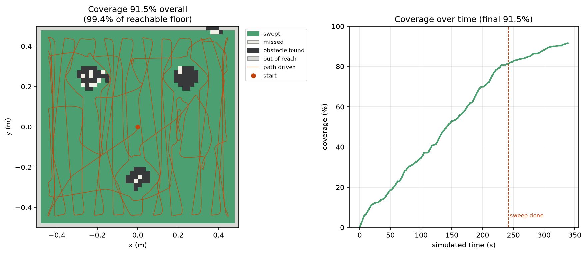
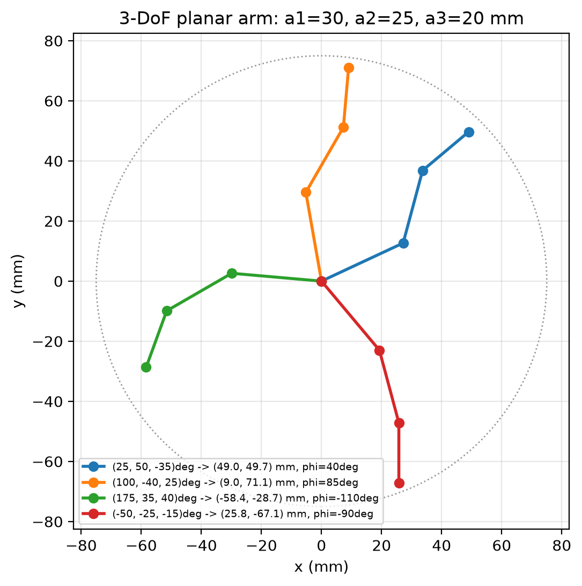

<div align="center">

# webots-projects

**Robot simulation coursework — coverage planning, industrial pick-and-place, and manipulator kinematics.**

<p>
  
  
  
</p>

Worlds, controllers, and analysis built for my robotics university course using
[Webots](https://cyberbotics.com/).

</div>

---

## Contents

| Project | What it does | Simulator |
| --- | --- | --- |
| [E-puck Roomba](#e-puck-roomba) | Systematic floor coverage of an unknown arena | Webots |
| [SCARA fruit sorting](#scara-fruit-sorting) | Industrial pick-and-place, deliberately mis-sorting | Webots |
| [Forward kinematics](#forward-kinematics) | 3-DoF planar RRR chain, pose from joint angles | Pure Python |

---

## E-puck Roomba

> `worlds/epuck.wbt` + `controllers/epuck_roomba`

Systematic floor coverage in the Tutorial 1 arena, with three wooden boxes. 
The robot is told **the size of its arena and nothing else**; the
walls and boxes are discovered by infra-red.

<div align="center">
  
</div>

It sweeps the floor in boustrophedon lanes 5 cm apart while building a 2 cm
occupancy and coverage grid, then switches to breadth-first search toward the
nearest cell that would still sweep new ground, until nothing reachable is left.

**Four layers, bottom-up:**

| Layer | Approach |
| --- | --- |
| **Odometry** | Wheel-encoder dead reckoning with midpoint integration, re-anchored to ground truth every 5 s via the supervisor API |
| **Perception** | IR readings converted to metric distances by inverting the sensor's own `lookupTable`, rather than picking magic thresholds |
| **Planning** | Lane sweep first, then BFS to the nearest uncovered cell — uniform edge cost means there is nothing for A\* to improve on |
| **Reactive** | A repulsive potential field with a tangential term blended into the waypoint bearing, plus a stall detector that backs out of traps |

**Last measured run:**

| Metric | Value |
| --- | --- |
| Coverage | **91.5%** — 2219 / 2426 cells, 0.888 m² |
| Of reachable floor | **99.4%** |
| Simulated time | 338.9 s |
| Stop reason | nothing reachable left to cover |
| True misses | **2 cells** |

```bash
# headless run — ends by itself when nothing reachable remains
/Applications/Webots.app/Contents/MacOS/webots --batch --minimize \
    --no-rendering --mode=fast --stdout --stderr worlds/epuck.wbt

# then render the figure above
uv run python analysis/plot_coverage.py
```

---

## SCARA fruit sorting

> `worlds/industrial_example.wbt` + `controllers/scara_food_industry`

An Epson SCARA T6 sorting fruit, adapted from the Cyberbotics sample of the same
name so that it sorts the fruit into the wrong crates: the robot alternates
orange, apple, orange, … and places each one in the crate originally intended
for the other. Its LED starts off and toggles on every fifth orange that has
been both picked and placed.

Every placement is printed, which is the quickest way to see the LED rule
holding:

```text
cycle   9  placed orange in the apple  bin  (orange #5)   -- LED ON
cycle  19  placed orange in the apple  bin  (orange #10)  -- LED OFF
cycle  29  placed orange in the apple  bin  (orange #15)  -- LED ON
```

> [!NOTE]
> As in the original sample, the grasp is faked. With supervisor access the
> fruit node is teleported just under the suction tool on every step it is
> held, and released by no longer doing so — there is no gripper physics.

```bash
# loops indefinitely; stop it when you have seen enough
/Applications/Webots.app/Contents/MacOS/webots --batch --minimize \
    --no-rendering --mode=fast --stdout --stderr worlds/industrial_example.wbt
```

---

## Forward kinematics

> `forward-kinematics/`

A 3-DoF planar RRR chain with link lengths 30 / 25 / 20 mm. Given three joint
angles it returns the end-effector pose `(x, y, φ)`, where φ is the sum of the
joint angles reduced to (−180°, 180°] — an orientation of 540° and one of 180°
are the same pose.

<div align="center">
  
</div>

```bash
uv run python forward-kinematics/main.py       # interactive: enter three angles
uv run python forward-kinematics/plot_arm.py   # renders the figure above
```

---

## Getting started

### Prerequisites

- **[Webots](https://cyberbotics.com/)** — R2025a, installed at
  `/Applications/Webots.app` on macOS.
- **[uv](https://docs.astral.sh/uv/)** — `brew install uv`.

```bash
uv sync          # everything, including pytest
uv sync --no-dev # runtime only
```

### Pointing Webots at the uv environment

The `controller` module is provided by Webots itself. It is **not** a pip
package. For controllers to also see this project's packages (`numpy`, the
shared `epucklib` library, …), Webots must run them with **this project's**
Python interpreter.

**Webots → Settings → General → Python command:**

```bash
<your-path-to-webots-projects>/.venv/bin/python
```

### Tests

`epucklib` never imports the Webots `controller` module, so all of it runs
under plain pytest — no simulator needed.

```bash
uv run pytest
```
